# Инструкция для работы с Markdown

## Выделение текста

Markdown предлагает два стиля написания заголовков: через решётки (#) и через подчёркивания (====). Можно использовать до шести уровней заголовков, но подчёркивания позволяют создавать только первые два. Для того чтобы выделить заголовок, необходимо поставить от 1 до 6 решёток (#) и пробел в самом начале строки. Уровень заголовка зависит только от количества решёток. Например, 

# Заголовок 1 уровня
## Заголовок 2 уровня
### Заголовок 3 уровня
#### Заголовок 4 уровня
##### Заголовок 5 уровня
###### Заголовок 6 уровня
__________________________________________________________________________________

«Подчёркивание» параграфа знаками равно (=) или дефисами (-) делает его заголовком первого или второго уровня соответственно. Уровень заголовка зависит только от типа «чёрточек», их количество значения не имеет. Например,

Заголовок 1 уровня
======
Заголовок 2 уровня
------
___

Чтобы выделить текст курсивом, необходимо обрамить его звездочками (*) или знаком нижнего подчеркивания (_). Например, *вот так* или _вот так_.

Чтобы выделить текст полужирным, необходимо обрамить его двойными значками (**) или двойным знаком нижнего подчеркивания (__). Например, **вот так** или __вот так__

Альтернативные способа выделения текста жирным или курсивом нужны для того, чтобы мы могли совмещать оба этих способа. Например, _текст может быть выделен курсивом и при этом быть **полужирным**_

Если необходимо зачеркнуть текст, то можно поставить по две тильды (~~) в начале и в конце фрагмента. Например, 
~~вот так~~

## Списки

Чтобы выделить неунсерованный список, используйте (*) или знаком (+). Например, вот так:
* Эллемент 1
* Эллемент 2
* Эллемент 3
+ Эллкмкнт 4

Чтобы добавить нумерованные списки, необходимо пункты просто пронумеровать. Например, вот так:
1. Первый пункт
2. Второй пункт
3. Третий пункт

Любые списки можно вкладывать друг в друга, для этого перед маркером нужно поставить tab или несколько пробелов, затем поставить символ (*),(-),(+) Например, вот иак:
1. Первый пункт
    * подпункт
2. Второй пункт
    1. подпункт
    2. подпункт

## Работа с изображением

Чтобы вставить изображение в текст, достаточно написать следующее:

## Ссылки

Markdown предлагает 3 стиля разметки ссылок: строчный, справочный и автоматический.

### 1. Строчные 

Для вставки ссылки в строчном стиле необходимо воспользоваться следующей конструкцией: [Текст ссылки]​(URL). Есть возможность добавить подсказку, для этого нужно после URL дописать текст в кавычках: [Текст ссылки]​(URL "Подсказка"). 
Например: 

Ссылка из википедии про [markdown](https://ru.wikipedia.org/wiki/Markdown "информационный сайт")!

Ссылка из википедии про [git](https://ru.wikipedia.org/wiki/Git)!

### 2. Справочные 

Для вставки ссылки в справочном стиле нужно написать [Текст ссылки]​[Ключ] в том месте, где вы хотите её поместить, а где-нибудь выше или ниже добавить сноску [Ключ]: URL "Подсказка". Например

У [GitHub][info] есть свой [сайт][site].

[info]: https://ru.wikipedia.org/wiki/GitHub "Информация из википедии по GitHub"
[site]: https://github.com/ "сайт GitHub"

### 3. Автоматические

Markdown позволяет использовать упрощённый вариант для вставки ссылок, для этого нужно просто обернуть URI треугольными скобками (<ссылка>).

Можно вставлять адреса электронной почты (<адрес почты>), тогда мы автоматически получим ссылку типа mailto:. Например:

При возникновении вопросов, заходите на сайт <https://gb.ru/> в раздел faq либо пишите на почту <support@geekbrains.ru>

## Работа с таблицами

Чтобы добавить таблицы, необходимо размечать их с помощью вертикальных черт ( | ), а заголовок отделяется дефисами ( - ). Например, вот так:

| Месяц  | Кол-во рабочих дней | Кол-во выходных дней |
|:------:|:-------------------:|:--------------------:|
| Январь |         16          |          15          |
| Февраль|         19          |          9           |
| Март   |         22          |          9           |

Можно поставить двоеточие ( : ) рядом с дефисами для выравнивания текста:

по левой стороне (|:----|)
по центру (|:----:|)
по правой стороне (|----:|)

## Цитаты

Если в начале строки поставить треугольную скобку (>), то Markdown превратит текст после неё в цитату. Внутри могут быть любые блоки: параграфы, заголовки или даже другие цитаты. Например:

> Одна треугольная скобка
превращает в цитату несколько строк,
идущих друг за другом.

> ## Цитаты великих людей
> С большой силой приходит большая ответственность
>
>*- Дядя Бен, кинофильм "Человек-паук"*

Можно сделать дочернюю цитату внутри родительской с помощью двойного знака (>>). Например: 
>вот так
>>вот так

## Заключение

Markdown  — облегчённый язык разметки, созданный с целью обозначения форматирования в простом тексте, с максимальным сохранением его читаемости человеком, и пригодный для машинного преобразования в языки для продвинутых публикаций.

________

# Информация по работе с git

1. Для начала работы с git, вам необходимо скачать и установить программу, в который вы будете в дальнейшем писать свой код, Я используюсь Visual Studio Code, вы можеие скачать его [здесь](https://code.visualstudio.com/)
>Если вы хотите использовать другой редактор кода, Вы можете воспользоваться программой из этого перечня:
>
>| №  |       Название       | №  |     Название     |
>|:--:|:--------------------:|:--:|:----------------:|
>| 1  |  Visual Studio Code  | 6  |   Komodo IDE     |
>| 2  |     IntelliJ IDEA    | 7  |   Sublime Text   |
>| 3  |       PyCharm        | 8  |   Brackets       |
>| 4  |       PhpStorm       | 9  |   Atom           |
>| 5  |       WebStorm       | 10 |   NetBeans       |

2. Cкачиваем Git по [этой ссылке](https://git-scm.com/book/ru/v2/%D0%92%D0%B2%D0%B5%D0%B4%D0%B5%D0%BD%D0%B8%D0%B5-%D0%A3%D1%81%D1%82%D0%B0%D0%BD%D0%BE%D0%B2%D0%BA%D0%B0-Git)

3. Создаем папку на компьютере, в которой будет находиться наш проект

4. Открываем VSCode и добавляем созданную папку добавляем папку 

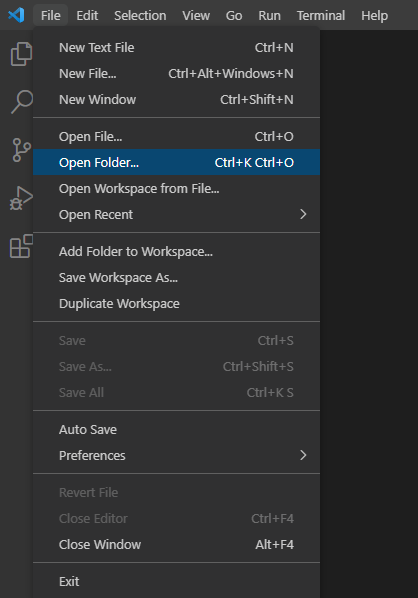

5. Создаем в папке новый вайл через пронрамму VSCode 

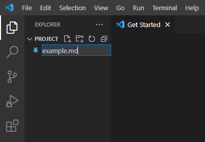

>Расширение файла может быть другое, мы используем .md

6. Открываем терминал, в котором будем работать с git

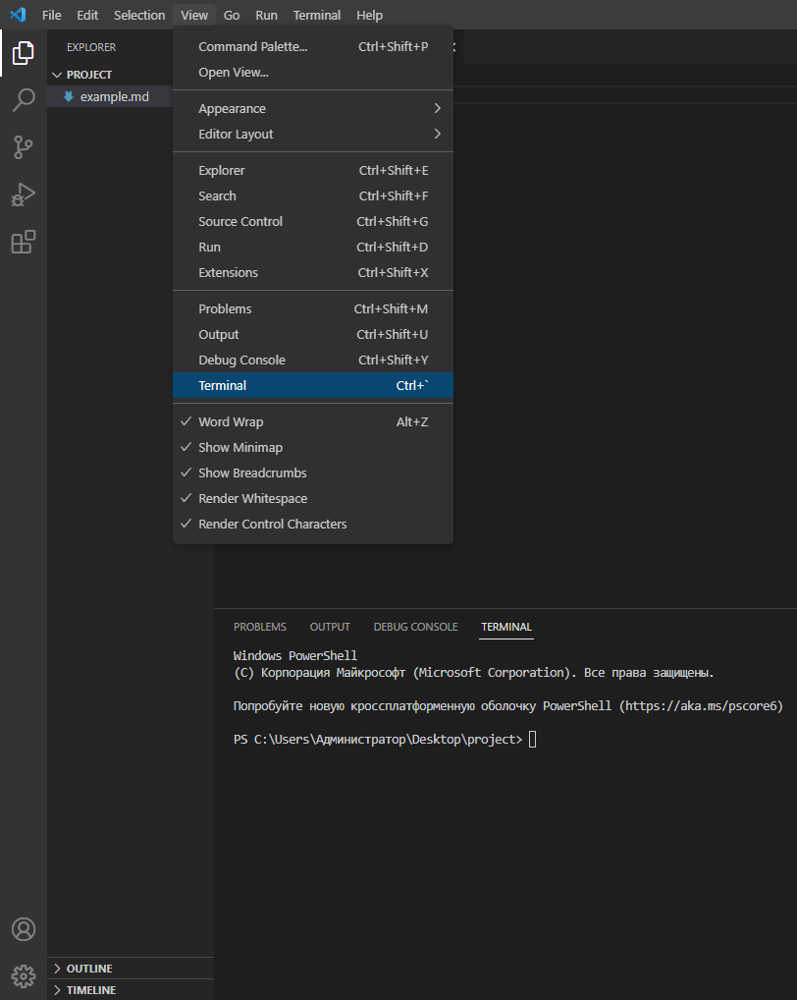

7. Для инициализации системы необходимо представиться программе. В терминале необходимо ввести следующие команды:

>git config --global user.name «Ваше имя англ буквами»
>
>git config --global user.email ваша_почта@example.com

7. Затем надо иницировать папку как репозиторий. Для этого необходимо к терменале ввести команду
>git init

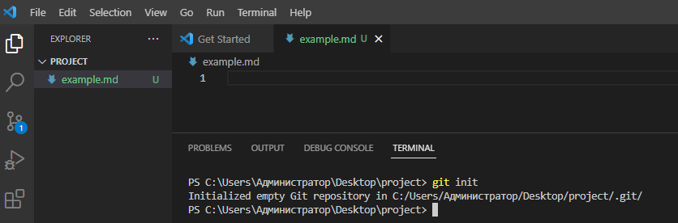

8. Программа сама подсказывает какие изменения в документе были выполнены м что необходимо сделать. Для этого ннадо ввести команду
>git status

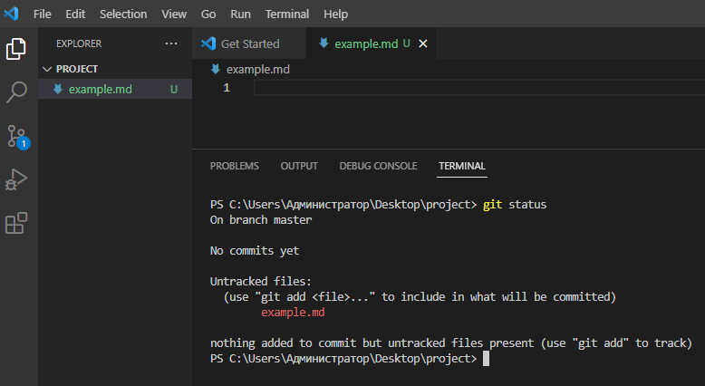

Программа говорит, что наш файл **example.md** не отслеживается и для решения данной проблемы необходимо ввести команду
>git add (Имя файла)

При введении команды и при повторной проверке статуса проекта мы видим, что документ отслеживается и его можно "закоммитить"

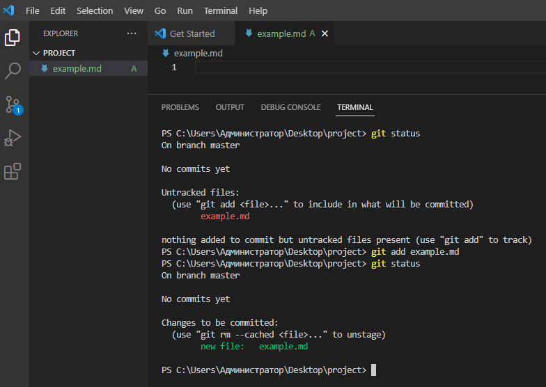

9. Что такое "Закоммитить"? Это значит, что надо сохранить то, что мы внесли командой git add, при этом необходимо написать комментарий для уточнения сохраненных изменений и лучшей ориентации по сохраненным элементам. Делается это с помощью команды
>git commit -m "коментарий"

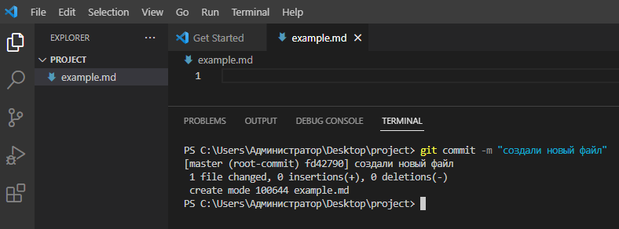

10. Для дальнейшей команды сделаем изменения в файле, сохраним их сочитанием клавиш **Ctr+S** и с помощью команд **git add** и **git commit** сохраним изменения. Чтобы просмотреть все созданные сохранения, необходимо ввести команду
>git log

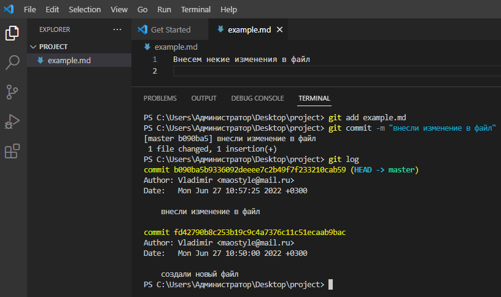

11. Как мы видим на изображении, у нас есть 2 коммита со своим номером, выделенным желтым цветом, выделив первые четыре значения этого номера, мы можем перемещаться между сохранениями, для этого используют команду 
>git checkout (первые 4 номера коммита)

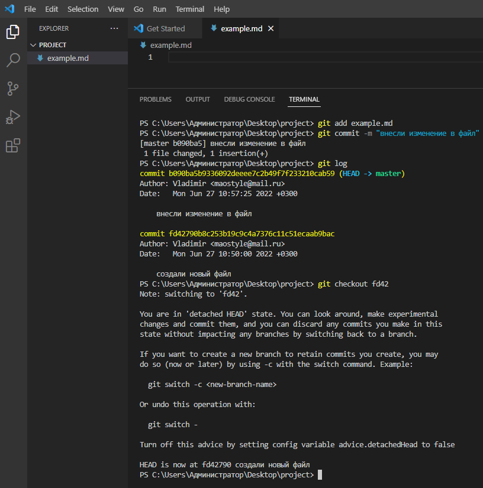

Заметьте, мы вернулись на исходный коммит, последняя запись "Внесем некие изменения в файл" в ней отсуствует. Вернуться обратно мы можем также с использованием комманды **git checkout** 

12.  Также хотелось бы упомянуть о ветках, они же branch. Изначально гит создает одну основную ветку, ее название можно увидеть при введении команды 
>git branch

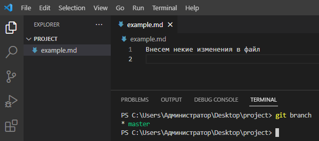

На изображении основная ветка имеет название master, также она выделена знаком ( * ) это значит, что мы находимся в данной ветке. Мы можем создавать несколько веток, это позваляет нам тестировать разный код, который в последствии можно встроить в основной документ. Для этого необходимо воспользоваться командой
>git branch (название новой ветки)

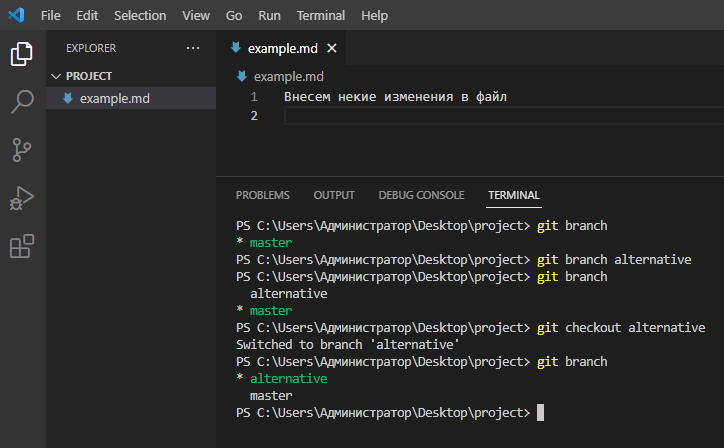

Командой **git branch alternative** мы создали новую ветку под названием *alternative*
Через команду **git branch** мы видим уже две ветки, но мы по прежнему находимся в ветке *master*. Для перехода на другую ветку, используем команду **git checkout (название ветки)**. Далее через **git branch** мы видим, что находимся в нужной нам ветке.

Давайте сделаем несколько изменений в новой ветке, и воспользуемся функцией слияния веток.

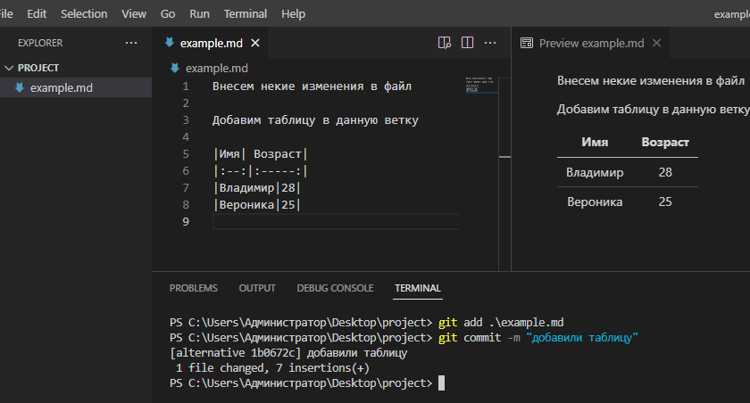

Перейдем в главную ветку и воспользуемся командой для слиянияветок
>git merge (название альтернативной ветки)

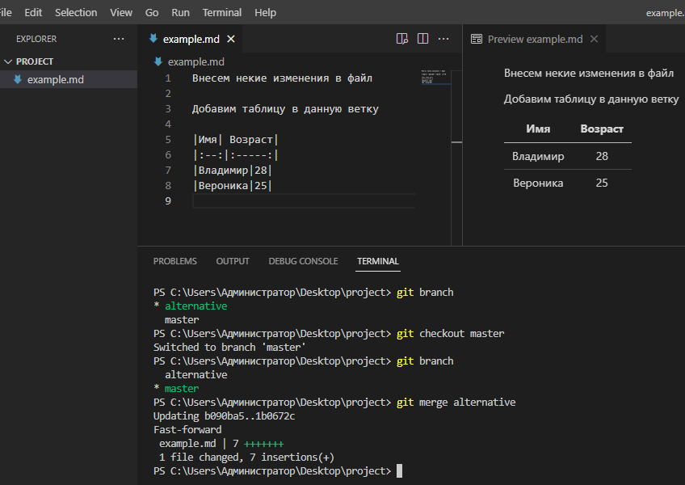

Теперь все, что мы делали в альтернативной ветке, переместилось на главную ветку. Для удаления альтернативной ветки необходимо ввести команду
>git branch -d (название ветки, которую необходимо удалить)

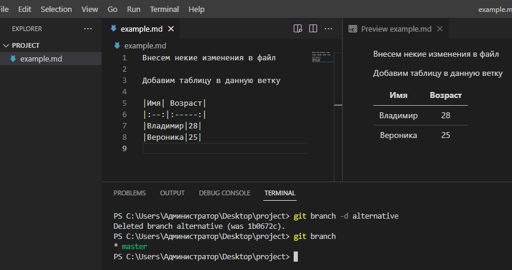

Как мы видим, альтернативная ветка удалена

## Заключение ## 

Таким образом мы видим, что git - хороший инструмент для работы с контролем версий, который не требует знаний большого количества команд и вполне подходит начинающиму специалисту.